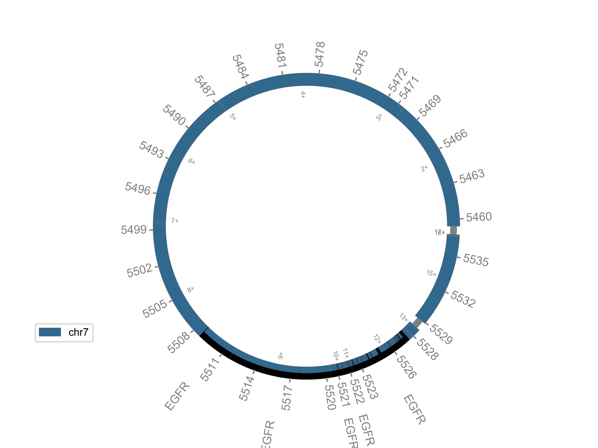
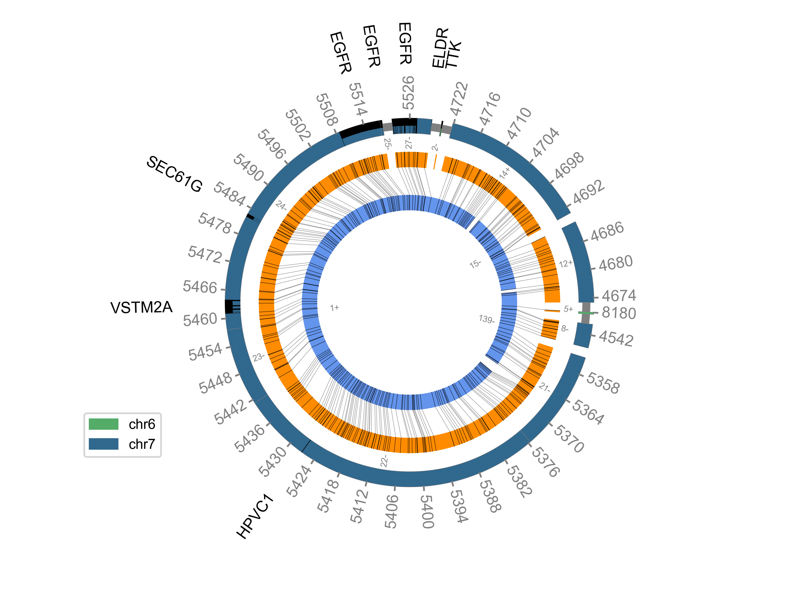

## CycleViz

Visualize outputs of [AmpliconArchitect](https://github.com/virajbdeshpande/AmpliconArchitect/) & [AmpliconReconstructor](https://github.com/jluebeck/AmpliconReconstructor) (AR) in Circos-style images. Supports hg19, hg38, and GRCh37. CycleViz has been tested on Ubuntu 16.04+.

**Examples**: Left, a cycles file visualization without AR-reconstruction data. Right, a cycles file visualization with Bionano data. 

Seperate instructions [are available](###running-cycleviz-with-an-aa-generated-cycles-file) if using an AA cycles file without AR reconstruction.

<!---{:height="300px" width="300px"}
{:height="300px" width="300px"} --->

 


### Installation

Requires python2 and matplotlib version 2.0.0 or higher and intervaltree python module. 

To check your matplotlib version in python, type
```
import matplotlib
print matplotlib.__version__
```

To upgrade to latest matplotlib from command line, do 
```
pip install --upgrade matplotlib
```

To install intervaltree python package. 
```
pip install intervaltree
```

To get the Microsoft fonts on Ubuntu (CycleViz defaults to Arial font)
```
sudo apt-get install ttf-mscorefonts-installer
```

If you are using this with AR, after cloning the CycleViz repo consider running the following to add a line to your `.bashrc` file to enable automatic generation of CycleViz figures at the end of an AR run. 

`cd CycleViz/`

`echo export CV_SRC=$PWD >> ~/.bashrc`

`source ~/.bashrc`

### Usage
There are two modes of visualization, circular and linear. Currently there are separate scripts to run each mode, but we intend to merge these in the future.

using the `--help` command will output a specific description of each argument below.

For circular visualizations do 

`CycleViz.py [-h] [--om_alignments] --cycles_file CYCLES_FILE --cycle
                   CYCLE [-c CONTIGS] [-s SEGS] [-g GRAPH] [-i PATH_ALIGNMENT]
                   [--sname SNAME] [--rot ROT] [--label_segs]
                   [--gene_subset_file GENE_SUBSET_FILE]
                   `

For linear visualizations do 

` LinearViz.py [-h] [--om_alignments] [-s SEGS] [-g GRAPH] [-c CONTIGS]
                    --cycles_file CYCLES_FILE --path PATH [-i PATH_ALIGNMENT]
                    [--sname SNAME] [--label_segs]
                    [--reduce_path REDUCE_PATH REDUCE_PATH]
                    [--gene_subset_file GENE_SUBSET_FILE | --gene_subset_list GENE_SUBSET_LIST [GENE_SUBSET_LIST]
                    `

The `--gene_subset_file` or `--gene_subset_list` arguments can be used to reduce the genes shown in the visualization. By default all genes (except lncRNAs, microRNAs, etc.) will be shown. An cancer-related genelist file is provided: `Bushman_group_allOnco_May2018.tsv`, which was taken from [here](http://www.bushmanlab.org/links/genelists)

Note that the cycles file and cycle number (or "path number", in the linear case) are the only required arguments. It is highly recommended to use the Bushman oncogene file for the gene_subset_file to make more readable plots


### Running CycleViz with an AA-generated cycles file
If using an AA-generated cycles file instead of AR, whose segments are merged across adjacent breakpoint graph segments, you will first need to unmerge the segments in the cycles file. We provide a script, `convert_cycles_file.py` which can be run on an AA cycles file and AA breakpoint graph. This script must be run to generate a BPG-converted cycles file, prior to running CycleViz. Many thanks to Siavash R. Dehkordi for providing this script.

